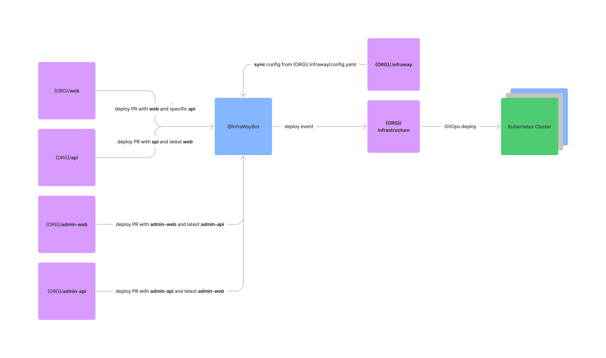

# gh-deploy-bot

This is a GitHub bot that simplifies the process of deployment for organizations from multiple interconnected repositories.

It listens certain [GitHub events](https://docs.github.com/en/developers/webhooks-and-events/events) (pull request, commit) and triggers a new deployment to be created for defined applications.

That allows your dev team to develop and deploy their code to personal dev environments e.g. `https://pull-123.customer-domain.com` managed by Kubernetes.


## Diagram flow




## Setup

1. Create a repo named `.infraway` it should contain a file `config.yaml`. Find example of such configuration in [here](https://github.com/InfraWay/gh-deploy-bot/blob/main/.infraway/config.yaml.example)
2. Install bot into kubernetes cluster using docker image: [infraway/gh-deploy-bot](https://hub.docker.com/r/infraway/gh-deploy-bot)
3. Follow install instructions inside the bot to conect it to GitHub organization.
4. Try to make a PR in a repository, that defined in the `config.yaml` file.

## Configuration

Configuration file should be located at: `.infraway/config.yaml`

```yaml
domain: domain.tech

events:
  pull_request_opened: "deploy" # or "ignore", deploy by default
  pull_request_reopened: "deploy" # or "ignore", deploy by default
  commit: "deploy" # or "ignore", deploy by default

stale_pull_cleanup:
  enabled: true
  duration: "7 days"

deploy:
  - name: repo-name1
    components:
      - name: web
        chart: ./charts/web
        needs:
          - static
        version: commit
      - name: static
        version: release
        repo: repo-name2
      - name: api
        chart: ./charts/web.api
        needs: # a dependency on another component, when deploy happens, both components will be redeployed
          - db
        version: commit
      - name: db
        version: data
      - name: mailer
        addon: true # a component which is not installed by default with push, but can be added by a comment
        version: release

versions:
  - name: commit
    description: latest commit made in the repo (default value)
  - name: release
    description: latest release from the repo
  - name: ^.+$
    description: predefined version
```

## Docker

```sh
# 1. Build container
docker build -t gh-deploy-bot .

# 2. Start container
docker run -e APP_ID=<app-id> -e PRIVATE_KEY=<pem-value> gh-deploy-bot
```

## Contributing

If you have suggestions for how gh-deploy-bot could be improved, or want to report a bug, open an issue! We'd love all and any contributions.

For more, check out the [Contributing Guide](CONTRIBUTING.md).

## License

[MIT](LICENSE) © 2022 [Andrew Red](https://andrew.red)
